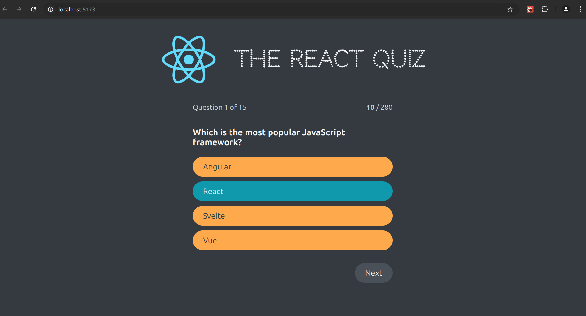

# React Quiz


The project uses the fake API from the JSON server to show some questions about the React Ecosystem.

# Stack used


### Other tools:

- [Eslint](https://eslint.org/)
- [Prettier](https://prettier.io/)
- [asdf](https://asdf-vm.com/)
- [Conventional Commits](https://www.conventionalcommits.org/en/v1.0.0/)
- [JSON server](https://www.npmjs.com/package/json-server)

## Authors

- [Me](https://www.linkedin.com/in/devfandre/)

## Clone this repo

```
git clone git@github.com:fandredev/react-quiz.git
```

## Go to directory

```
 cd react-quiz
```

## Install dependencies

```
 yarn install
```

## Run API Server

```
 yarn run server
```

## Run WEB server

```
 yarn run dev
```

## :mailbox_with_no_mail: Contacts

E-mail: profissionalf.andre@gmail.com<br>
Linkedin: https://www.linkedin.com/in/devfandre/<br>
